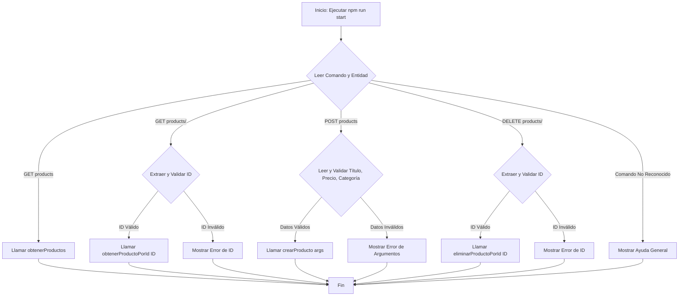

```mermaid
graph TD
    A[Inicio: Ejecutar npm run start] --> B{Leer Comando y Entidad}

    B -- GET products --> C[Llamar obtenerProductos]
    B -- GET products/<id> --> D{Extraer y Validar ID}
    D -- ID Válido --> E[Llamar obtenerProductoPorId ID]
    D -- ID Inválido --> F[Mostrar Error de ID]

    B -- POST products <args> --> G{Leer y Validar Título, Precio, Categoría}
    G -- Datos Válidos --> H[Llamar crearProducto args]
    G -- Datos Inválidos --> I[Mostrar Error de Argumentos]

    B -- DELETE products/<id> --> J{Extraer y Validar ID}
    J -- ID Válido --> K[Llamar eliminarProductoPorId ID]
    J -- ID Inválido --> L[Mostrar Error de ID]

    B -- Comando No Reconocido --> M[Mostrar Ayuda General]

    C --> N[Fin]
    E --> N
    F --> N
    H --> N
    I --> N
    K --> N
    L --> N
    M --> N
```